# 👁️ Dristi AI
<div align="center">


[](https://vercel.com/new/clone?repository-url=https://github.com/iamsoura005/Dristi_Ai)
[](https://choosealicense.com/licenses/mit/)
[](https://github.com/iamsoura005/Dristi_Ai/stargazers)
[](https://github.com/iamsoura005/Dristi_Ai/network)

</div>

## 🌟 What is Dristi AI?

**Dristi AI** is a cutting-edge web application that revolutionizes eye healthcare through artificial intelligence. Named after the Sanskrit word for "vision," our platform combines advanced deep learning models with intuitive user experience to provide comprehensive eye disease detection and analysis.

```mermaid
graph TD
    A[📸 Upload Fundus Image] --> B[🧠 AI Analysis]
    B --> C[🔍 Disease Detection]
    B --> D[🎨 Heatmap Generation]
    C --> E[📄 Medical Report]
    D --> E
    E --> F[💬 AI Consultation]
    
    style A fill:#e1f5fe
    style B fill:#f3e5f5
    style C fill:#fff3e0
    style D fill:#f1f8e9
    style E fill:#fce4ec
    style F fill:#e8f5e8
```

<div align="center">



</div>

## ✨ Features That Set Us Apart

<table>
<tr>
<td width="50%">

### 🎯 Core Capabilities
- **🔬 8 Eye Disease Detection**
  - Normal, Diabetes, Glaucoma, Cataract
  - AMD, Hypertension, Myopia, Others
- **🌈 Color Blindness Testing**
  - Ishihara plate-based assessment
- **🧠 Explainable AI**
  - Heatmap visualizations
- **📋 Medical Reports**
  - PDF generation with analysis

</td>
<td width="50%">

### 🛠️ Advanced Features  
- **🔐 User Authentication**
  - Secure login system
- **💬 AI Chatbot**
  - Real-time medical assistance
- **📊 Analytics Dashboard**
  - Comprehensive health insights  
- **🌐 Cross-Platform**
  - Web, mobile responsive

</td>
</tr>
</table>

## 🚀 Quick Start

<div align="center">

### Option 1: Deploy with Vercel (Recommended)
[](https://vercel.com/new/clone?repository-url=https://github.com/iamsoura005/Dristi_Ai)

### Option 2: Local Development

</div>

```bash
# 📥 Clone the repository
git clone https://github.com/iamsoura005/Dristi_Ai.git
cd Dristi_Ai

# 🔧 Backend Setup
cd backend
python -m venv venv
source venv/bin/activate  # On Windows: venv\Scripts\activate
pip install -r requirements.txt
python app.py

# 🎨 Frontend Setup (New Terminal)
cd frontend
npm install
npm run dev

# 🌐 Access the application
# Frontend: http://localhost:3000
# Backend API: http://localhost:5000
```

## 🏗️ Architecture

<div align="center">

```
🏠 Dristi AI Architecture
┌─────────────────────────────────────────────────────────┐
│                    🌐 Frontend (Next.js)                │
├─────────────────────────────────────────────────────────┤
│  📱 React Components  │  🎨 TailwindCSS  │  ⚡ Framer   │
│  🔄 State Management  │  📊 Recharts     │  🔧 TypeScript│
├─────────────────────────────────────────────────────────┤
│                    🔗 API Layer                         │
├─────────────────────────────────────────────────────────┤
│                   ⚙️ Backend (Flask)                    │
├─────────────────────────────────────────────────────────┤
│  🧠 ML Models  │  🗃️ Database   │  🔐 Authentication    │
│  🖼️ Image Proc │  📄 PDF Gen    │  💬 Chat System      │
└─────────────────────────────────────────────────────────┘
```

</div>

## 🛠️ Tech Stack

<div align="center">

### Frontend


### Backend


### Deployment


</div>

## 📊 API Endpoints

<details>
<summary>🔍 <strong>Click to expand API documentation</strong></summary>

### 🏥 Medical Analysis
```http
POST /api/predict
Content-Type: multipart/form-data
Body: image (fundus image file)
```

### 🌈 Color Blindness Test
```http
POST /api/ishihara/test
Content-Type: application/json
Body: {"responses": ["1", "2", "3", ...]}
```

### 🔐 Authentication
```http
POST /api/auth/register
POST /api/auth/login  
POST /api/auth/logout
```

### 🔍 Health Check
```http
GET /api/health
```

</details>

## 🎯 Supported Eye Conditions

<div align="center">

| 🏥 Condition | 📝 Code | 🔍 Description |
|--------------|---------|----------------|
| ✅ Normal | N | Healthy retina |
| 🩸 Diabetes | D | Diabetic retinopathy |
| 👁️ Glaucoma | G | Glaucomatous changes |
| 🌫️ Cataract | C | Lens opacity |
| 🎯 AMD | A | Age-related Macular Degeneration |
| 💓 Hypertension | H | Hypertensive retinopathy |
| 🔍 Myopia | M | Pathological myopia changes |
| 🔬 Others | O | Other retinal conditions |

</div>

## 🔒 Security Features

- 🛡️ **JWT Authentication**: Secure token-based auth
- 🧹 **Input Validation**: Comprehensive sanitization  
- 🌐 **CORS Configuration**: Secure cross-origin requests
- ⚙️ **Environment Variables**: Secure config management
- 🔐 **Data Encryption**: Protected user information

## 🤝 Contributing

We love contributions! Here's how you can help make Dristi AI even better:

```mermaid
gitGraph
    commit id: "🍴 Fork"
    branch feature
    checkout feature
    commit id: "✨ Feature"
    commit id: "🧪 Test"
    checkout main
    merge feature
    commit id: "🚀 Deploy"
```

<div align="center">



</div>

1. 🍴 **Fork** the repository
2. 🌿 **Create** your feature branch (`git checkout -b feature/AmazingFeature`)
3. 💾 **Commit** your changes (`git commit -m 'Add some AmazingFeature'`)
4. 📤 **Push** to the branch (`git push origin feature/AmazingFeature`)
5. 🔄 **Open** a Pull Request

<div align="center">

### 🌟 Contributors

[](https://github.com/iamsoura005/Dristi_Ai/graphs/contributors)

</div>

## 📈 Project Stats

<div align="center">


</div>

## 🎖️ Achievements

<div align="center">

[](https://github.com/iamsoura005/Dristi_Ai)
[](https://github.com/iamsoura005/Dristi_Ai)
[](https://github.com/iamsoura005/Dristi_Ai)

</div>

## 📄 License

This project is licensed under the MIT License - see the [LICENSE](LICENSE) file for details.

<div align="center">

---

### 🌟 Star History

[](https://star-history.com/#iamsoura005/Dristi_Ai&Timeline)

---


**Made with ❤️ for better eye healthcare**

[](https://github.com/iamsoura005/Dristi_Ai)
[](mailto:contact@dristiai.com)


</div>
